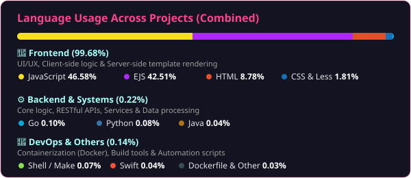

## Hi there 👋 I'm Wanchai Pratoom
Full Stack Developer based in Bangkok, Thailand 🇹🇭

I love writing code, building web applications, and exploring new technologies. My main focus is on backend systems, databases, and creating robust APIs.

📫 **Let's Connect**: 📧 [its.wanchai.p@gmail.com](mailto:its.wanchai.p@gmail.com) | 💼 [LinkedIn: Wanchai Pratoom](#)

🌱 **Currently exploring**: Go, Scalable Architecture, and Cloud Infrastructure  
⚡ **Fun fact**: I enjoy solving complex logic problems and constantly learning new tools.

---

### 🛠️ Skills & Technologies

* **Frontend:**     
* **Backend:**    
* **Database & DevOps:**      

---

#### 📊 Language Usage Across Projects

 

